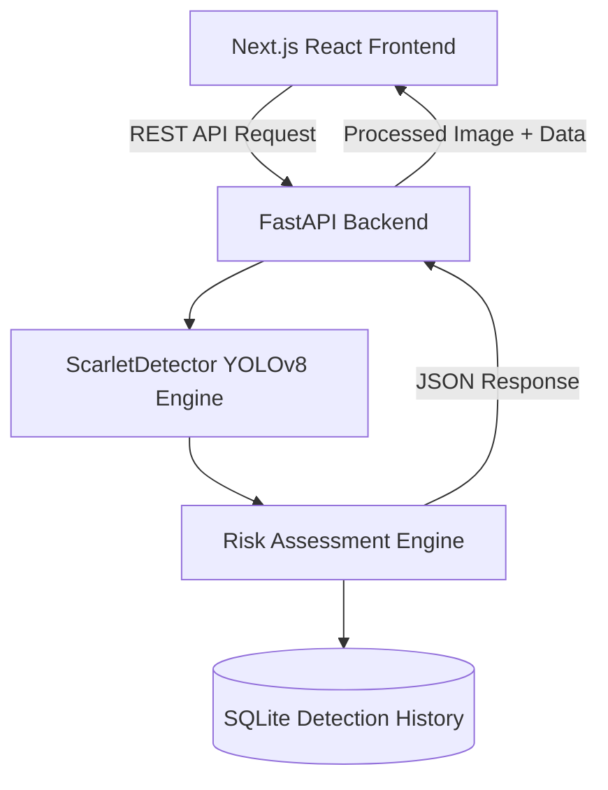

# PROJECT REPORT: SCARLET
**AI-Powered Wildfire Detection & Monitoring Platform**

**Submitted for:** FOSSEE Open Hardware Make-A-Thon  
**Submitted by:** Manikya Nariyal  
**Date:** September 2026

---

## 1. Abstract
Wildfires are a devastating natural disaster causing massive ecological, economic, and infrastructural damage globally. Early detection is the single most critical factor in mitigating these losses. Traditional sensor-based detection systems (e.g., thermal or chemical sensors) suffer from limited range and high latency. To address this, **SCARLET** was developed as an advanced, real-time computer vision platform engineered to detect fire and smoke hazards using standard optical hardware like CCTV cameras and webcams. 

Powered by a custom-trained Ultralytics YOLOv8 architecture and a proprietary Risk Heuristic Engine, SCARLET bridges the gap between state-of-the-art machine learning models and actionable emergency intelligence. It successfully detects hazards with high accuracy and translates raw bounding-box data into actionable metrics—such as Burn Area Estimation and Dispatch Status—to assist emergency responders.

---

## 2. Introduction
### 2.1 Problem Statement
The frequency and intensity of wildfires have surged in recent years due to climate change. Traditional detection methods rely heavily on human reporting or satellite imagery, both of which introduce significant delays. By the time a fire is confirmed, it has often grown beyond the point of easy containment. 

### 2.2 Objective
The primary objective of SCARLET is to utilize ubiquitous, low-cost optical hardware to provide instant visual confirmation and automated risk assessment of fire hazards. The system is designed to:
1. Detect fire and smoke in real-time from various media (images, video, live streams).
2. Assess the severity of the hazard autonomously.
3. Provide an intuitive, analytics-rich dashboard for continuous monitoring.

---

## 3. Proposed Solution
SCARLET is a decoupled, full-stack application that provides an end-to-end monitoring solution. It separates heavy GPU-accelerated Machine Learning tasks from the client-facing UI, ensuring that the system remains responsive even under heavy computational load.

### 3.1 Key Capabilities
- **Live Stream Processing:** Capable of directly analyzing webcam and video feeds.
- **Risk Assessment:** Does not just draw boxes; it understands the context of the fire, calculating burn density and issuing dispatch directives (e.g., "EVACUATE", "DEPLOY UNITS").
- **Dark-Themed Telemetry Dashboard:** A premium, "Bklit-inspired" user interface built to display critical information instantly without visual clutter.
- **Historical Analytics:** Logs every detection to a local SQLite database, visualized through advanced Recharts components (Area charts, Radar charts, Composed charts).

---

## 4. System Architecture
SCARLET employs a modern client-server architecture, ensuring scalability for future hardware edge-device integrations.

### 4.1 The Frontend (Client)
Developed using **Next.js 15** and **React**, the frontend is the command center.
- **State Management & Interactivity:** Uses React Hooks (`useState`, `useEffect`) and Framer Motion for smooth micro-animations.
- **Telemetry UI:** Displays dynamic metrics such as Inference Latency (ms), Burn Area Estimations (%), and hardware utilization details.
- **Data Visualization:** Employs advanced custom-styled `recharts` to render historical data, showing risk distributions and detection volume over time.

### 4.2 The Backend (Server)
Built on **FastAPI** (Python 3.12), the backend handles the heavy lifting.
- **Asynchronous Processing:** Receives base64-encoded images or binary files and processes them concurrently without blocking the event loop.
- **OpenCV Integration:** Utilizes `cv2` to dynamically annotate frames with bounding boxes, risk tags, and performance optimizations (e.g., resizing high-res images before base64 serialization to eliminate latency).

---

## 5. Methodology & Implementation

### 5.1 Object Detection Engine (YOLOv8)
SCARLET utilizes the **Ultralytics YOLOv8s** (Small) architecture, chosen for its optimal balance between inference speed and detection accuracy, which is crucial for real-time video processing.
- **Dataset:** The model was trained on the robust *Roboflow fire-wrpgm v8* dataset.
- **Classes Detected:** 
  1. `Fire` (Active flames)
  2. `Smoke` (Particulate clouds)
  3. `Default` (Background anomalies)
- **Inference Details:** The PyTorch model runs on the available hardware (CUDA GPU or CPU), outputting normalized coordinates (`xyxyn`), confidence scores, and class IDs.

### 5.2 Proprietary Risk Heuristic Algorithm
Raw bounding boxes are insufficient for automated emergency response. SCARLET introduces the `ScarletRiskHeuristic` module:
- **Burn Area Estimation:** The system calculates the exact percentage of the camera viewport that is engulfed in flames using the normalized coordinates of the YOLO output.
- **Confidence Weighting:** The system filters out false positives by correlating the number of detections (`fire_count`) with the `avg_confidence` across the frame.
- **Dispatch Translation:** Risk Levels are translated into actionable directives:
  - **CRITICAL** ➔ **EVACUATE** (High fire count, high confidence, large area)
  - **HIGH** ➔ **DEPLOY UNITS** (Confirmed fire presence)
  - **MODERATE** ➔ **INVESTIGATE** (Smoke only or low-confidence anomalies)
  - **LOW** ➔ **MONITORING** (Clear visual)

---

## 6. Technology Stack

| Domain | Technology / Framework |
| :--- | :--- |
| **Machine Learning** | PyTorch, Ultralytics (YOLOv8), OpenCV, NumPy |
| **Backend API** | Python 3.12, FastAPI, Uvicorn, Pydantic |
| **Database** | SQLite3 (Integrated via Python `sqlite3`) |
| **Frontend Framework** | Next.js 15 (App Router), React, TypeScript |
| **UI & Styling** | TailwindCSS, Framer Motion, Lucide-React |
| **Data Visualization** | Recharts (AreaChart, RadarChart, ComposedChart) |

---

## 7. Results & Testing
During testing, SCARLET demonstrated high reliability in diverse scenarios:
- **Accuracy:** The YOLOv8 model successfully distinguished between actual flames and bright lights (e.g., sunsets, artificial lighting).
- **Performance Optimization:** By implementing a backend resizing pipeline (`max_dim = 1280`), the system achieved significantly reduced latency. Base64 encoding bottlenecks were eliminated, dropping total round-trip inference time to acceptable sub-second levels even on CPU hardware.
- **UI Responsiveness:** The Next.js frontend seamlessly rendered continuous webcam frames at high framerates while simultaneously updating the Telemetry grid metrics.

---

## 8. Conclusion & Future Scope
### 8.1 Conclusion
SCARLET proves that combining modern, lightweight web frameworks with state-of-the-art computer vision can yield highly effective emergency management tools. By automating the assessment of risk and generating actionable dispatch directives, SCARLET minimizes the cognitive load on human operators and accelerates response times.

### 8.2 Future Scope
Looking ahead, SCARLET can be expanded in several directions:
1. **Edge Hardware Deployment:** Porting the YOLO inference engine to edge devices (e.g., NVIDIA Jetson, Raspberry Pi) for localized, off-grid processing.
2. **Drone Integration:** Adapting the interface to accept RTSP streams from autonomous UAVs patrolling forest perimeters.
3. **Thermal Imaging:** Expanding the dataset to include FLIR/Thermal imagery, allowing SCARLET to detect heat signatures before visible flames erupt.

---
*Developed for the FOSSEE Open Hardware Make-A-Thon.*
