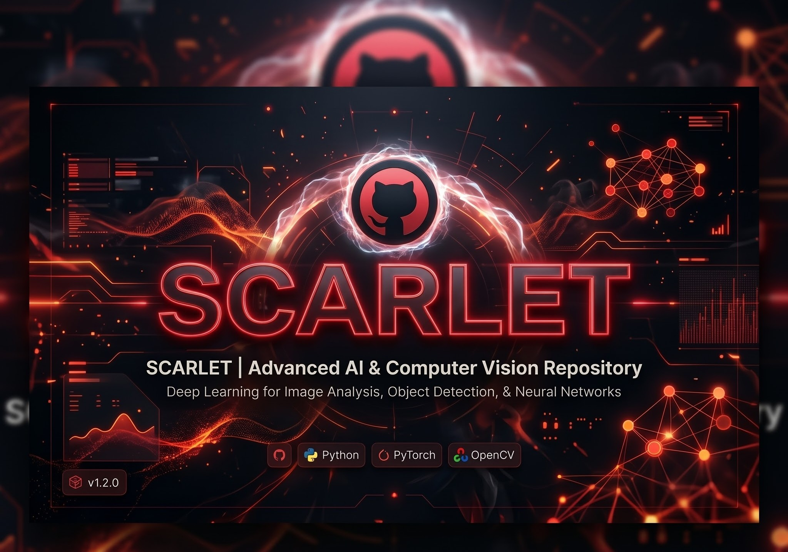
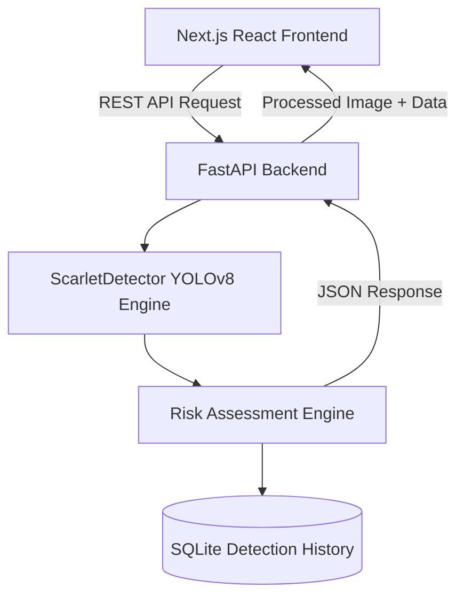

<div align="center">
  

  # SCARLET
  
  **AI-Powered Wildfire Detection & Monitoring Platform**
  
  [](https://opensource.org/licenses/MIT)
  [](https://python.org)
  [](https://pytorch.org/)
  [](https://nextjs.org/)
  [](https://fastapi.tiangolo.com/)
  
  *Detect, monitor, and assess wildfire and smoke hazards in real-time with state-of-the-art computer vision.*

</div>

---

## Overview

**SCARLET** is an advanced computer vision platform designed to detect fire and smoke hazards from images, video streams, and live webcam feeds. Built on a custom-trained **YOLOv8** architecture, it provides high-speed, high-accuracy inference.

Beyond simple detection, SCARLET implements a **Risk Heuristic Engine** that analyzes detection density, confidence distributions, and temporal patterns to assign hazard levels (LOW, MODERATE, HIGH, CRITICAL) in real-time.

---

## Features

- **Real-time Inference:** Lightning-fast detection powered by PyTorch and Ultralytics YOLOv8.
- **Risk Heuristic Engine:** Proprietary algorithm that evaluates the severity of the detection.
- **Multi-Modal Input:** Support for static images, video processing, and live webcam streams.
- **Interactive Analytics:** Deep visual insights using Recharts and an integrated SQLite data logger.
- **Decoupled Architecture:** A lightweight, premium Next.js frontend paired with a heavy-duty FastAPI Python backend.

---

## Architecture

SCARLET employs a modern decoupled architecture, allowing for scalable deployments where the heavy GPU ML tasks are separated from the client-facing UI.



---

## Quick Start

To run SCARLET locally, you need to spin up both the FastAPI backend and the Next.js frontend.

### 1. Start the ML Backend (FastAPI)
The backend requires Python 3.12+ and installs the necessary PyTorch and OpenCV libraries.

```bash
# Clone the repository
git clone https://github.com/m4n1kya/Scarlet.git
cd Scarlet

# Activate virtual environment (Windows)
.\.venv\Scripts\activate

# Install dependencies (if not already installed)
pip install -r requirements.txt

# Start the FastAPI server
uvicorn backend_app:app --reload --port 8000
```
> API is now running at `http://localhost:8000`

### 2. Start the Frontend (Next.js)
The frontend requires Node.js (v18+).

```bash
# Navigate to the frontend directory
cd frontend

# Install Node dependencies
npm install

# Start the development server
npm run dev
```
> Dashboard is now running at `http://localhost:3000`

---

## Repository Structure

```text
SCARLET/
├── backend_app.py        # FastAPI entrypoint for the ML engine
├── frontend/             # Next.js React Application
│   ├── src/app/          # Page routing (Dashboard, Analytics, History)
│   └── src/components/   # Reusable UI components
├── models/               # Contains the YOLOv8 weights (best.pt)
├── src/                  # Core Python modules
│   ├── analytics/        # Charting and data aggregation
│   ├── detection/        # YOLOv8 wrappers and image processors
│   ├── risk/             # Heuristic rules engine
│   └── storage/          # SQLite database integrations
├── tests/                # Comprehensive Pytest suite
└── assets/               # Demo media and documentation assets
```

---

## Contributing

We welcome contributions! Please see our [Contributing Guidelines](CONTRIBUTING.md) for details on how to submit pull requests, report issues, and request features.

---

## License & Attributions

- **Codebase:** Distributed under the MIT License.
- **ML Engine:** Powered by [Ultralytics YOLOv8](https://github.com/ultralytics/ultralytics) (AGPL-3.0).
- **Dataset:** Initial model trained on the [Roboflow fire-wrpgm v8](https://universe.roboflow.com/custom-thxhn/fire-wrpgm/dataset/8) (CC BY 4.0).

<div align="center">
  <br>
  Developed by <a href="https://github.com/m4n1kya">Manikya N.</a>
</div>
